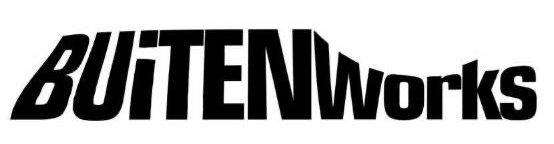

# 🧶 Buitenworks

> **Modern Fashion E-Commerce Prototype**
> *Developed as part of "Tugas Proyek Teknologi Informasi"*



## 📖 Tentang Project

**Buitenworks** adalah sebuah prototype website fashion modern yang dikembangkan dengan fokus utama pada **User Interface (UI)** dan **User Experience (UX)**. Project ini dirancang untuk memberikan pengalaman belanja yang estetis, minimalis, dan responsif di berbagai perangkat.

Project ini dibangun menggunakan teknologi web native tanpa framework CSS/JS berat, menjadikannya ringan dan mudah dipelajari struktur dasarnya.

---

## ✨ Fitur Utama

Project ini mencakup beberapa halaman dan fitur interaktif (UI Only):

*   **🏠 Homepage Modern**: Hero section yang menarik dan showcase produk unggulan.
*   **👕 Halaman Katalog**: Grid layout responsif untuk menampilkan produk.
*   **👥 Komunitas (Masonry)**: Galeri dengan layout masonry yang dinamis untuk menampilkan foto komunitas.
*   **📝 Archives**: Placeholder halaman blog dengan layout yang bersih.
*   **🔐 Autentikasi UI**: Modal pop-up untuk Login dan Registrasi yang interaktif.
*   **🛒 Shopping Cart**: Sidebar keranjang belanja (Drawer) yang halus dengan animasi slide-in.
*   **📱 Responsif**: Tampilan tetap rapi di Desktop, Tablet, dan Mobile.

---

## 🛠️ Teknologi yang Digunakan


*   **HTML5**: Struktur semantik yang rapi.
*   **CSS3**: Custom styling, Flexbox, Grid, dan CSS Variables (Root).
*   **Vanilla JavaScript**: Interaksi UI (Cart drawer, Modal, Tab switching) tanpa library eksternal.

---

## 📂 Struktur File

```text
Protein-Final/
│── index.html              # Homepage
│── catalog.html            # Halaman Produk
│── community.html          # Galeri Komunitas (Masonry)
│── archives.html           # Blog / Artikel
│── about.html              # Informasi Brand
│── login.html              # Halaman Login Standalone
│── account.html            # Dashboard User
│── styles.css              # Stylesheet Utama
│── scripts.js              # Logika Interaksi Web
│── assets/                 # Folder Gambar & Logo
│    ├── buitenworks-logo.png
│    ├── prod1–prod4.jpg
│    └── community1–community6.jpg
```

---

## 🚀 Cara Menjalankan

Karena project ini adalah Static Web Page, anda tidak memerlukan server backend khusus.

1.  **Clone** atau **Download** repository ini.
2.  Buka folder project.
3.  Klik dua kali pada file `index.html` untuk membuka di browser default anda.
4.  Atau gunakan ekstensi **Live Server** di VS Code untuk pengalaman development yang lebih baik.

---

## 🔮 Pengembangan Selanjutnya

Fitur yang dapat ditambahkan untuk membuat sistem ini fungsional sepenuhnya:
- [ ] Integrasi Backend & Database (MySQL/Firebase).
- [ ] Fungsi Checkout & Payment Gateway nyata.
- [ ] CMS untuk mengelola konten Blog/Archives.
- [ ] User Dashboard yang dinamis.

---

## 📝 Credits

Dibuat untuk memenuhi **Tugas Proyek Teknologi Informasi**.
*("Belajar membangun, bukan hanya memakai.")*
